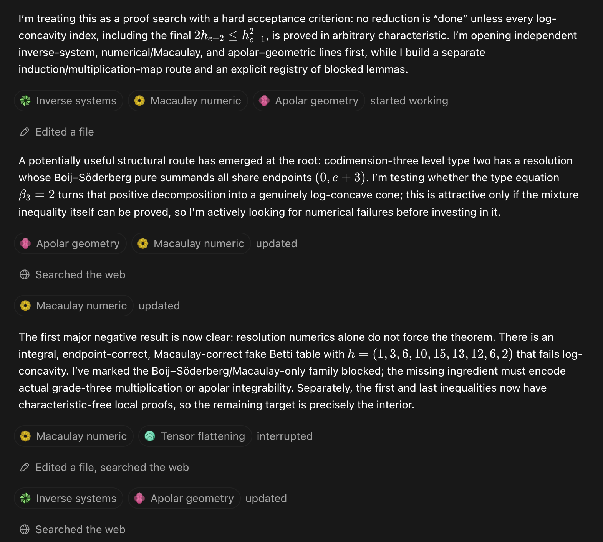
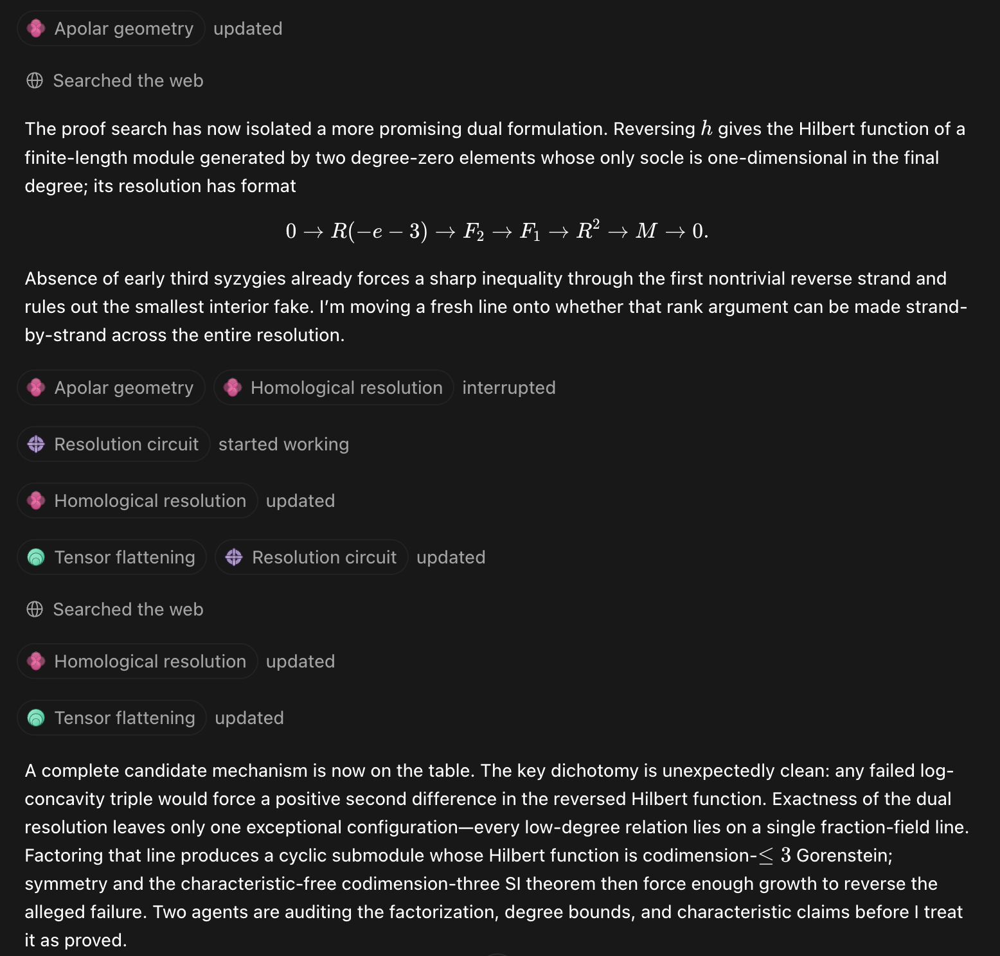

# zanello-lc

**A candidate proof that every codimension-3, type-2 level Hilbert function is log-concave — generated and machine-audited by LLM agents.**

## The problem

Let $R = k[x_1,x_2,x_3]$ over any field $k$, and let $A = R/I$ be a standard graded Artinian **level** algebra of Cohen–Macaulay **type 2**, with Hilbert function $h = (1, 3, h_2, \ldots, h_e = 2)$. The question — posed by Zanello ([arXiv:2210.09447](https://arxiv.org/abs/2210.09447), building on work of Iarrobino) and described there as *"the main case that remains open ... still open in any characteristic"* — is whether every such $h$ is log-concave:

$$h_{i-1}\,h_{i+1} \le h_i^2 \qquad (1 \le i \le e-1).$$

This repository contains a **candidate affirmative proof, in every characteristic**, together with the prompt that produced it, the working notes from the multi-agent search, and independent numerical verification code.

## Status — read this first

- The proof is **AI-generated** (a multi-agent LLM run; the exact prompt is in [`prompt/`](prompt/)).
- It has been **adversarially machine-audited**: every numbered step was independently re-derived; the single external dependency (Stanley's theorem on codimension-3 Gorenstein $h$-vectors, via Zanello's characteristic-free proof) was verified line-by-line down to Macaulay's theorem; and the fragile steps were stress-tested numerically in characteristics 2, 3, 5 and 0 (see [`verification/`](verification/)).
- It has **not yet been refereed by a human expert**. Until it has, it should be treated as a candidate proof, not a theorem. Scrutiny, bug reports, and counterexample attempts are welcome — please open an issue.

## The argument in one paragraph

Reindex the graded Matlis dual of $A$ as a module $M$ with Hilbert function $g_d = h_{e-d}$; levelness of type 2 makes $M$ two-generated in degree 0, with dual minimal resolution $0 \to R(-e-3) \to F_2 \to F_1 \to R^2 \to M \to 0$. The last syzygy has rank one and **full support** (its coordinates are the minimal generators of $I$), so every proper subset of the columns of $F_2 \to F_1$ is independent over $\mathrm{Frac}(R)$. A putative log-concavity failure at a triple forces, via a rank count on degree strands, a **rank-one family of low-degree relations**. That family factors as $v \cdot J$ for a primitive equal-degree vector $v \in R^2$ and an ideal $J$, and the image of $v$ in $M$ generates a cyclic submodule whose annihilator defines an Artinian Gorenstein algebra of embedding dimension ≤ 3. A degree bound places the relevant Hilbert-function increment in that algebra's first half, where Stanley's characteristic-free theorem (Zanello's elementary proof) makes it nonnegative — producing a positive log-concavity margin and a contradiction.

## Repository layout

| Path | Contents |
|---|---|
| [`paper/`](paper/) | The candidate proof: LaTeX source and compiled PDF (4 pages, self-contained modulo the cited Stanley/Zanello theorem). |
| [`prompt/`](prompt/) | The full prompt given to the LLM system that produced the proof. |
| [`notes/`](notes/) | Working artifacts from the search: the earlier long-form proof draft ([`candidate_proof.md`](notes/candidate_proof.md)), the multi-agent approach registry with blocked/active routes ([`approach_registry.md`](notes/approach_registry.md)), and status notes. |
| [`verification/`](verification/) | Independent numerical verification, written from scratch (no CAS): inverse-system construction of type-2 level algebras over $\mathbb{F}_2, \mathbb{F}_3, \mathbb{F}_5, \mathbb{Q}$, checks of every structural claim of the setup, the rank-one factorization, end-to-end log-concavity, and a direct stress test of the Stanley/Zanello input. See [`verification/README.md`](verification/README.md). |
| [`exploration/`](exploration/) | Historical search-phase scripts (enumeration, lex/Betti bounds, tensor flattenings, …). Kept as artifacts of the process; not needed for the proof and not maintained. |
| [`REFERENCES.md`](REFERENCES.md) | The literature consulted during the run. Third-party paper sources were used locally but are **not redistributed here**; links are provided instead. |

## Reasoning traces from the run

Two snapshots of the orchestrator's progress updates during the multi-agent search (agent chips show the parallel approach families from [`notes/approach_registry.md`](notes/approach_registry.md)).

Early rounds: the portfolio is opened, a Boij–Söderberg route is floated and then **killed by a concrete negative result** — a numerically consistent fake Betti table with $h = (1,3,6,10,15,13,12,6,2)$ that fails log-concavity, proving resolution numerics alone can't force the theorem:



Later rounds: the pivot to the dual-resolution formulation $0 \to R(-e-3) \to F_2 \to F_1 \to R^2 \to M \to 0$, and the moment the final mechanism came together — the rank-one dichotomy, the cyclic Gorenstein submodule, and adversarial agents auditing the factorization and characteristic claims before accepting it:



## Reproducing the numerical checks

Python 3.12+, `sympy` required only for `verify_dual_lemmas.py`:

```bash
pip install sympy
python3 verification/verify_dual_lemmas.py   # ~5 min: 248 level algebras, all structural + LC checks
python3 verification/stress_stanley.py       # ~2 min: 810 Gorenstein h-vectors over F2/F3/F5, SI checks
```

Both scripts exit nonzero if any check fails. As committed, both pass with zero failures.

## Provenance

The proof, notes, and verification code were produced in July 2026 by Claude (Anthropic) agent sessions from the prompt in `prompt/`; the search phase, the writeup, and the adversarial audit were separate sessions. Repository assembled from the working directories of those sessions.
